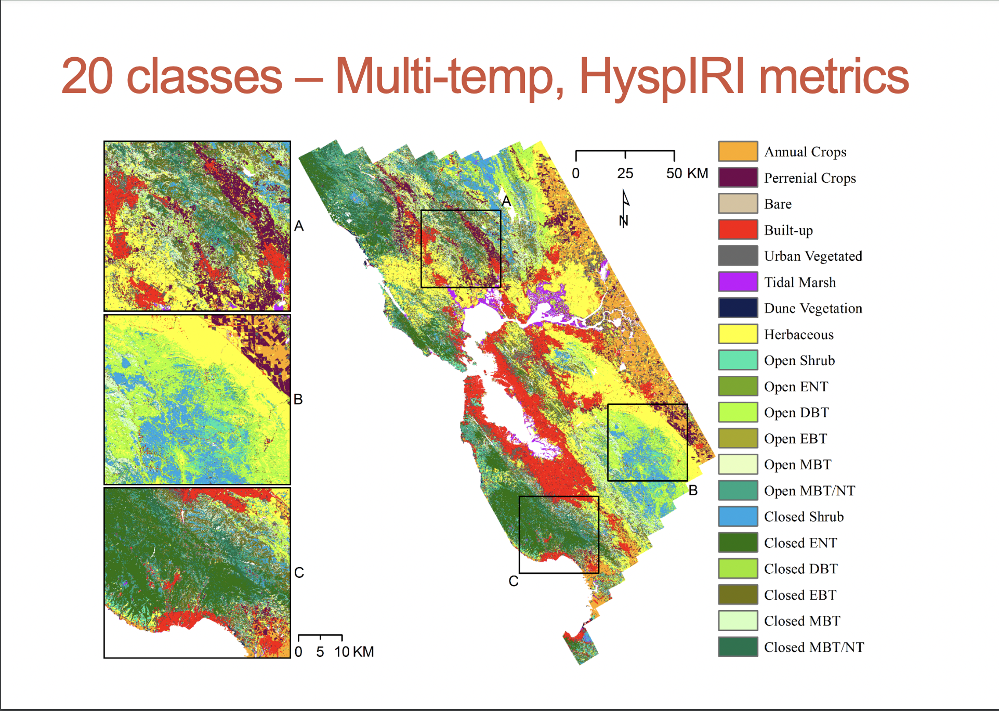

[<i class="fa fa-file-code-o fa-1x" aria-hidden="true"></i> Download this file as a template ](http://adamwilson.us/SpatialDataScience/scripts/Project_ProposalTemplate.Rmd).

# Introduction to problem/question

## Problem / Question
Comparing the differences in multispectral vs hyperspectral data when conducting unsupervised classification to identify different ecosystems in the Greater Cape Floristic Region of South Africa. 

## Example 1

These wavelength reflectance graphs show the NVDI and NDYI for several different species of vegetation. I plan to make wavelength reflectance graphs of the NDVI for the hyperspectral and multispectral data that I will be working with in this project. It will be interesting to compare if there are any differences between the two datasets and their reflectance. Image collected from: https://www.researchgate.net/figure/Spectral-NDVI-and-NDYI-profiles-derived-from-Sentinel-2-imagery-on-a-17-February-2020_fig2_354898182

## Example 2

This set of graphs is similar to what I want to produce with this project. The graphs show the differences with land use classification between multispectral and hyperspectral. This kind of graphic would be useful for my project and could easily be produced using ggplot2. Image collected from: https://hyspiri.jpl.nasa.gov/downloads/2015_Workshop/day2/17_clark_hyspiri_workshop_151014.pdf

## Example 3

This is a classification map that used hyperspectral data in a random forest model to create. This is one of the goals for the study area that I want to create. I will be using both hyperspectral and multispectral data in a kmeans model to create classification maps like this for my project. Image collected from: https://hyspiri.jpl.nasa.gov/downloads/2015_Workshop/day2/17_clark_hyspiri_workshop_151014.pdf

# Proposed data sources

I will be getting the hyperspectral data from the PRISMA satellite, and the multispectral data will be collected from Landsat for my study area. I will be using the vegetation map from the South African National Biodiversity Institute (SANBI) as validation data for both the hyperspectral and multispectral classifications.

PRISMA: https://sbg.jpl.nasa.gov/news-events/prisma-data-are-now-available-for-access

LANDSAT: https://www.usgs.gov/landsat-missions/landsat-data-access

SANBI Vegitetion Map: http://bgis.sanbi.org/Projects/Detail/208

# Proposed methods

Currently the proposed methods for this project will be to process both the hyperspectral and multispectral data and produce NDVIs from both of them. Then using a kmeans model, both data sets will be used in an unsupervised classification. Using the vegetation map from SANBI, both datasets will be validated using a confusion matrix to compare the accuracy for both models.

Proposed packages: caret, ggplot2, raster, sp, hsdar, rgdal, tidyverse, sf, lwgeom. Other packages may be used as well, and some of these packages may not be used if more efficient ways to process the data are found. 

# Expected results

My expected results are that the hyperspectral data will produce a more detailed land cover classification using the unsupervised classification than the multispectral data. This project will produce land cover maps for both the multispectral and hyperspectral classifications. Spectral data wavelength plots for both multispectral and hyperspectral. Comparison plots for the results and accuracy of the multispectral and hyperspectral data.
