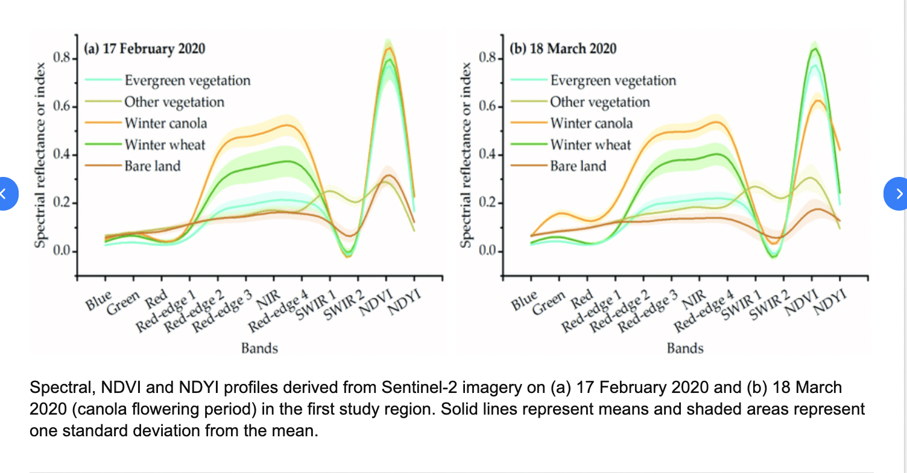
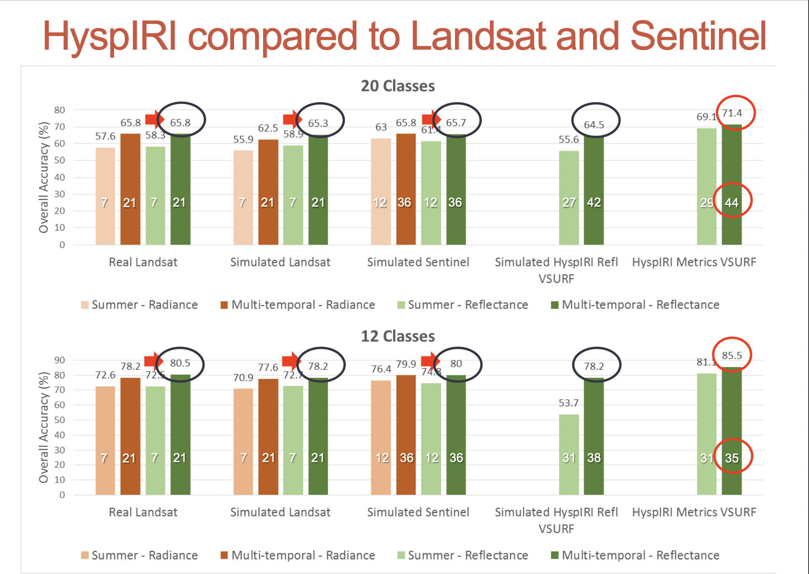
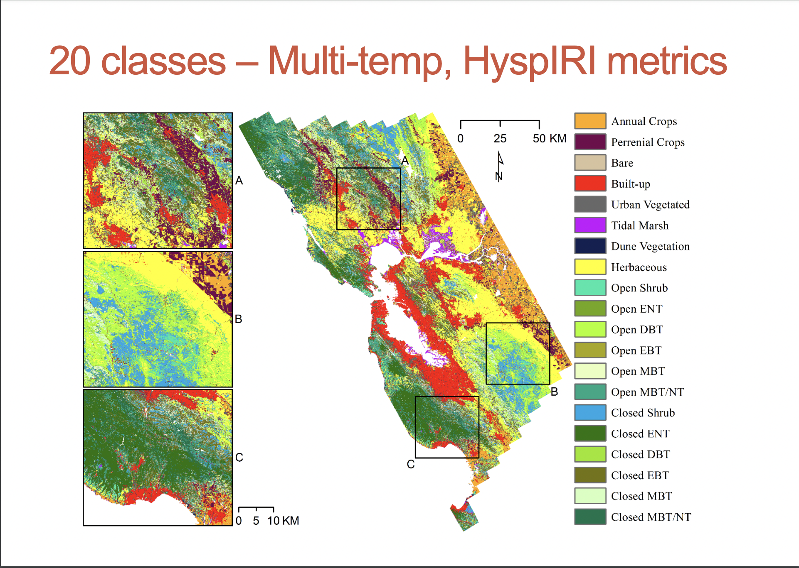

Multispectral and Hyperspectral comparison in South Africa’s Greater
Cape Floristic Region
================
Willow Flood

[<i class="fa fa-file-code-o fa-1x" aria-hidden="true"></i> Download
this file as a
template](http://adamwilson.us/SpatialDataScience/scripts/Project_ProposalTemplate.Rmd).

# Introduction to problem/question

## Problem / Question

Comparing the differences in multispectral vs hyperspectral data when
conducting unsupervised classification to identify different ecosystems
in the Greater Cape Floristic Region of South Africa.

## Example 1

These wavelength reflectance graphs show the NVDI and NDYI for several
different species of vegetation. I plan to make wavelength reflectance
graphs of the NDVI for the hyperspectral and multispectral data that I
will be working with in this project. It will be interesting to compare
if there are any differences between the two datasets and their
reflectance. Image collected from:
<https://www.researchgate.net/figure/Spectral-NDVI-and-NDYI-profiles-derived-from-Sentinel-2-imagery-on-a-17-February-2020_fig2_354898182>

## Example 2

This set of graphs is similar to what I want to produce with this
project. The graphs show the differences with land use classification
between multispectral and hyperspectral. This kind of graphic would be
useful for my project and could easily be produced using ggplot2. Image
collected from:
<https://hyspiri.jpl.nasa.gov/downloads/2015_Workshop/day2/17_clark_hyspiri_workshop_151014.pdf>

## Example 3

This is a classification map that used hyperspectral data in a random
forest model to create. This is one of the goals for the study area that
I want to create. I will be using both hyperspectral and multispectral
data in a kmeans model to create classification maps like this for my
project. Image collected from:
<https://hyspiri.jpl.nasa.gov/downloads/2015_Workshop/day2/17_clark_hyspiri_workshop_151014.pdf>

# Proposed data sources

I will be getting the hyperspectral data from the PRISMA satellite, and
the multispectral data will be collected from Landsat for my study area.
I will be using the vegetation map from the South African National
Biodiversity Institute (SANBI) as validation data for both the
hyperspectral and multispectral classifications.

PRISMA:
<https://sbg.jpl.nasa.gov/news-events/prisma-data-are-now-available-for-access>

LANDSAT: <https://www.usgs.gov/landsat-missions/landsat-data-access>

SANBI Vegitetion Map: <http://bgis.sanbi.org/Projects/Detail/208>

# Proposed methods

Currently the proposed methods for this project will be to process both
the hyperspectral and multispectral data and produce NDVIs from both of
them. Then using a kmeans model, both data sets will be used in an
unsupervised classification. Using the vegetation map from SANBI, both
datasets will be validated using a confusion matrix to compare the
accuracy for both models.

Proposed packages: caret, ggplot2, raster, sp, hsdar, rgdal, tidyverse,
sf, lwgeom. Other packages may be used as well, and some of these
packages may not be used if more efficient ways to process the data are
found.

# Expected results

My expected results are that the hyperspectral data will produce a more
detailed land cover classification using the unsupervised classification
than the multispectral data. This project will produce land cover maps
for both the multispectral and hyperspectral classifications. Spectral
data wavelength plots for both multispectral and hyperspectral.
Comparison plots for the results and accuracy of the multispectral and
hyperspectral data.
