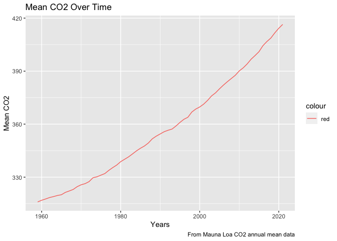

Case Study 08
================
Willow Flood
October 25, 2022

``` r
library(tidyverse)
```

    ## ── Attaching packages ─────────────────────────────────────── tidyverse 1.3.2 ──
    ## ✔ ggplot2 3.3.6      ✔ purrr   0.3.4 
    ## ✔ tibble  3.1.8      ✔ dplyr   1.0.10
    ## ✔ tidyr   1.2.0      ✔ stringr 1.4.1 
    ## ✔ readr   2.1.2      ✔ forcats 0.5.2 
    ## ── Conflicts ────────────────────────────────────────── tidyverse_conflicts() ──
    ## ✖ dplyr::filter() masks stats::filter()
    ## ✖ dplyr::lag()    masks stats::lag()

``` r
co2_data = read_table(file = ('ftp://aftp.cmdl.noaa.gov/products/trends/co2/co2_annmean_mlo.txt'), skip = 57, col_names = c("year", "mean", "unc"), comment = "#")
```

    ## 
    ## ── Column specification ────────────────────────────────────────────────────────
    ## cols(
    ##   year = col_double(),
    ##   mean = col_double(),
    ##   unc = col_double()
    ## )

``` r
library(ggplot2)
ggplot(co2_data, aes(x=year, y=mean)) +
  geom_line(aes(color = "red")) +
  labs(title = "Mean CO2 Over Time",
       y = "Mean CO2",
       x = "Years",
       caption = "From Mauna Loa CO2 annual mean data")
```

<!-- -->

``` r
knitr::kable(head(arrange(co2_data[,1:3], desc(year))), format = "simple", col.names = c("Year", "Mean", "UNC"), caption = "Mauna Loa CO2 Annual Mean")
```

| Year |   Mean |  UNC |
|-----:|-------:|-----:|
| 2021 | 416.45 | 0.12 |
| 2020 | 414.24 | 0.12 |
| 2019 | 411.66 | 0.12 |
| 2018 | 408.72 | 0.12 |
| 2017 | 406.76 | 0.12 |
| 2016 | 404.41 | 0.12 |

Mauna Loa CO2 Annual Mean
