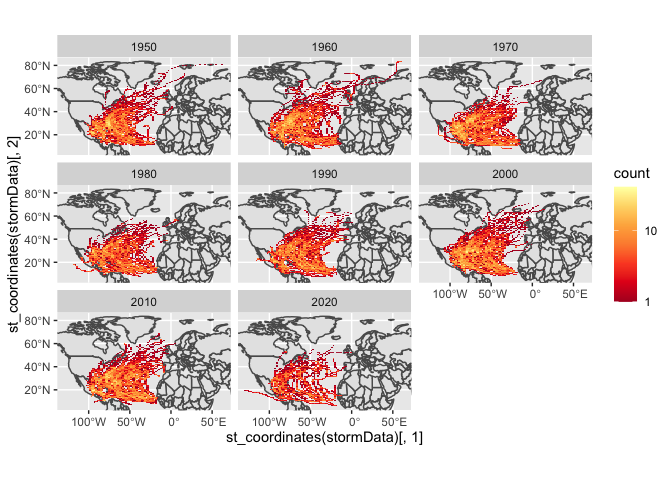

Case Study 09
================
Willow Flood
November 1, 2022

The libraries used in this case study

``` r
library(sf)
```

    ## Linking to GEOS 3.10.2, GDAL 3.4.2, PROJ 8.2.1; sf_use_s2() is TRUE

``` r
library(tidyverse)
```

    ## ── Attaching packages
    ## ───────────────────────────────────────
    ## tidyverse 1.3.2 ──

    ## ✔ ggplot2 3.3.6      ✔ purrr   0.3.4 
    ## ✔ tibble  3.1.8      ✔ dplyr   1.0.10
    ## ✔ tidyr   1.2.0      ✔ stringr 1.4.1 
    ## ✔ readr   2.1.2      ✔ forcats 0.5.2 
    ## ── Conflicts ────────────────────────────────────────── tidyverse_conflicts() ──
    ## ✖ dplyr::filter() masks stats::filter()
    ## ✖ dplyr::lag()    masks stats::lag()

``` r
library(ggmap)
```

    ## Google's Terms of Service: https://cloud.google.com/maps-platform/terms/.
    ## Please cite ggmap if you use it! See citation("ggmap") for details.

``` r
library(rnoaa)
```

    ## Registered S3 method overwritten by 'hoardr':
    ##   method           from
    ##   print.cache_info httr

``` r
library(spData)
```

    ## To access larger datasets in this package, install the spDataLarge
    ## package with: `install.packages('spDataLarge',
    ## repos='https://nowosad.github.io/drat/', type='source')`

The data used in this case study

``` r
data(world) #from spData
data(us_states) #from spData
#Download zipped data from noaa with storm track information
dataurl="https://www.ncei.noaa.gov/data/international-best-track-archive-for-climate-stewardship-ibtracs/v04r00/access/shapefile/IBTrACS.NA.list.v04r00.points.zip"
tdir=tempdir()
download.file(dataurl,destfile=file.path(tdir,"temp.zip"))
#unzip the compressed folder
unzip(file.path(tdir,"temp.zip"),exdir = tdir) 
storm_data <- read_sf(list.files(tdir,pattern=".shp",full.names = T))
```

Filtering the data so that it only contains from 1950 to present

``` r
stormData = storm_data %>%
  filter(SEASON > 1949) %>%
  mutate_if(is.numeric, function(x) ifelse(x==-999.0,NA,x)) %>%
  mutate(decade=(floor(year/10)*10))
```

Creating a bounding box of the data

``` r
region = st_bbox(stormData)
```

Making the plot faceted by decade

``` r
storm_map = ggplot(world) +
  geom_sf() +
  facet_wrap(~decade) +
  stat_bin2d(data=stormData, 
             aes(y=st_coordinates(stormData)[,2], 
                 x=st_coordinates(stormData)[,1]),bins=100) +
  scale_fill_distiller(palette="YlOrRd", 
                       trans="log", 
                       direction=-1, 
                       breaks = c(1,10,100,1000)) +
  coord_sf(ylim=region[c(2,4)], xlim=region[c(1,3)]) 
storm_map
```

<!-- -->
Calculating the five states that have the most storms

``` r
states = st_transform(us_states, crs = st_crs(stormData)) 
colnames(states)[2] = "state" 
storm_states <- st_join(stormData, states, join = st_intersects,left = F)
storms_top5 = storm_states %>%
  group_by(state) %>%
  summarise(storms=length(unique(NAME))) %>%
  arrange(desc(storms)) %>%
  st_set_geometry(NULL) %>%
  slice(1:5)
storms_top5
```

    ## # A tibble: 5 × 2
    ##   state          storms
    ##   <chr>           <int>
    ## 1 Florida            86
    ## 2 North Carolina     66
    ## 3 Georgia            58
    ## 4 Texas              54
    ## 5 Louisiana          52
